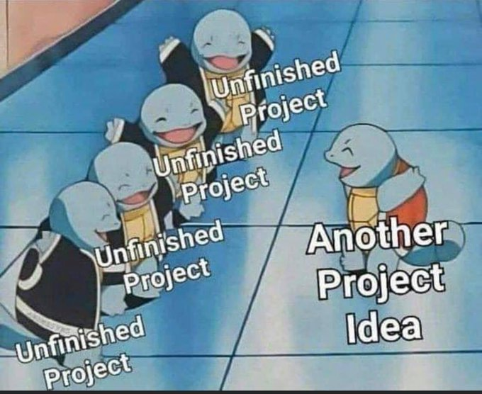

# stack-templates



a haskell project skeleton

the main things that make this unique:
- defaulting to AGPL 3+, instead of MIT
- adding a massive amount of extensions to the `default-extensions` field
- adding an `hie.yaml` file
- using base-prelude as default
- adding support for uncommong things that can be annoying to set up (data files, benchmarks)

In general, this is more designed around enabling rapid prototyping/creation
of projects than actually creating a good framework, i'm expcting that users
will cut out all the stuff they don't need if they ever get to a point where
they're shipping (the main user is me, and i never get to that point)

to use this, add this line to stack's config.yaml:
```
default-template: github:ikea-shark-official/skel
```

or call `stack new` using the template name above
